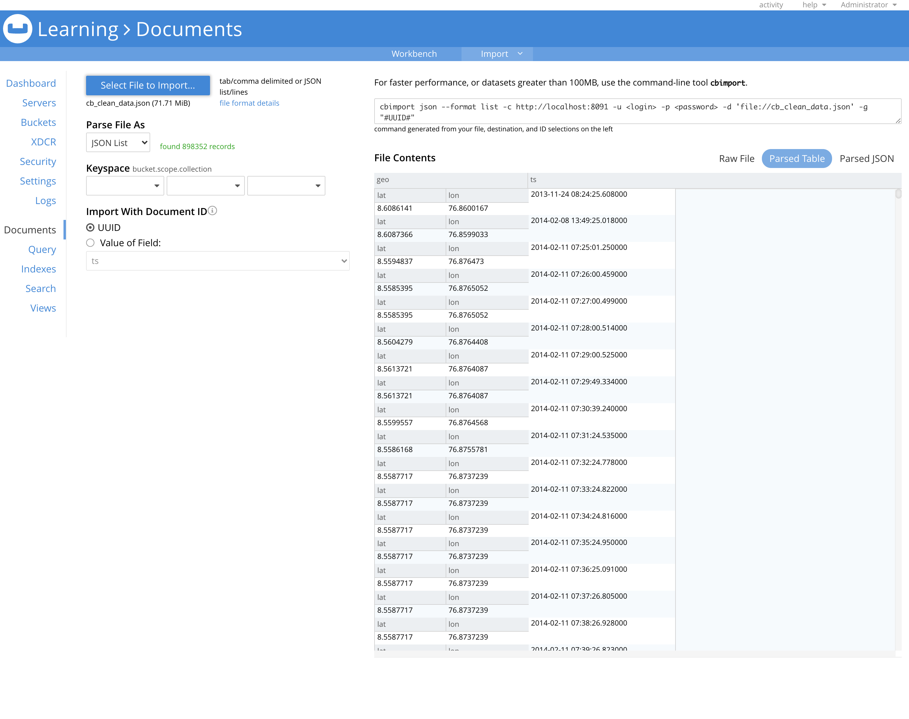
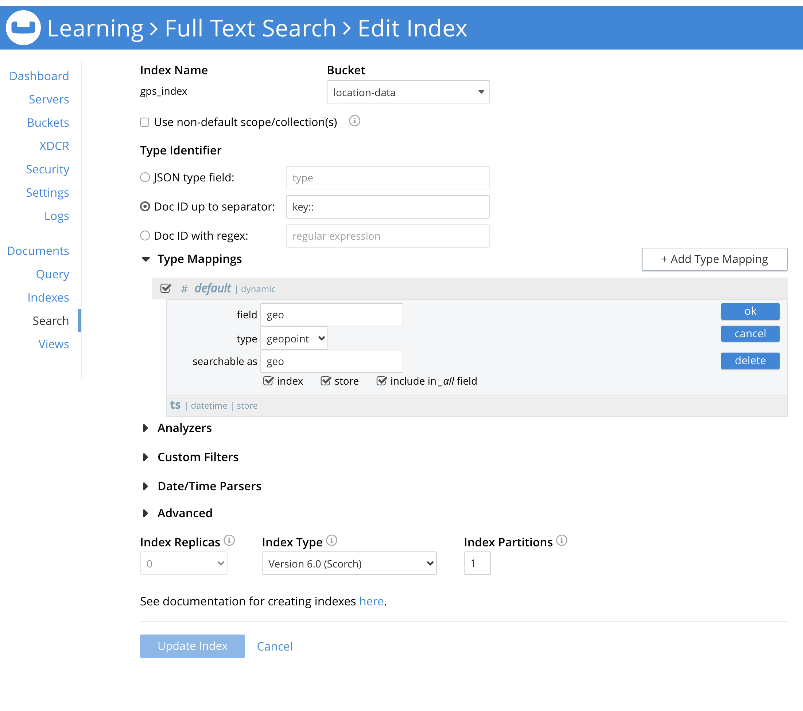
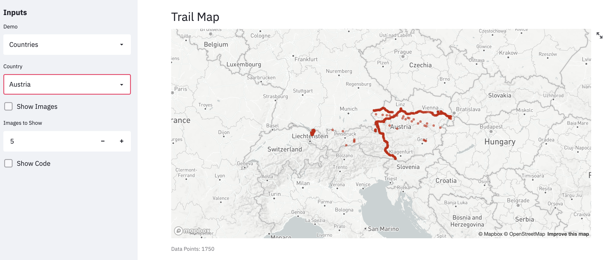
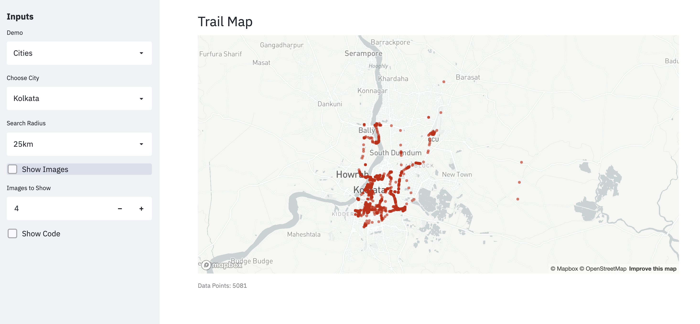

# visualize-location-history

A demo application to visualize the travel information from Google Maps Timeline using [Geospatial Querying Capabilities of Couchbase](https://docs.couchbase.com/server/current/fts/fts-supported-queries-geo-spatial.html#fts-creating-indexes.adoc) in Python.

The demo application allows the user to interactively filter the data based on the cities or countries. The selection would filter the location data trail based on the selection (country or city with a radius around it). Additionally, a specified number of random images can be obtained from [Flickr](https://www.flickr.com/) images of the locations in the dataset.

### Installation

Install the dependencies

`pip install -r requirements.txt`

### Instructions for Running

1. Get the Google Maps location history from [Google Takeout](https://takeout.google.com/settings/takeout).

2. Clean the data by running `data_modeling.py`. It removes all data except latitude, longitude & timestamps. The data is also converted in to the JSON format for importing into Couchbase.

   Sample Data Point:

   `{"ts": "2013-11-24 08:24:25.608000", "geo": {"lat": 8.6086141, "lon": 76.8600167}}`

3. Import the data `cb_clean_data.json` into Couchbase using the Import feature in the UI or [cbimport](https://docs.couchbase.com/server/current/tools/cbimport.html).
   

4. Create Full Text Search (FTS) Index to index the location data.
   

5. Load the GPS data for Cities & Countries into Couchbase using Import feature.

   Cities data: [Simplemaps](https://simplemaps.com/data/world-cities) : The 41000 cities data is free.

   Countries data: [Country Info](https://github.com/porimol/countryinfo) : It has location data for all countries.

6. Create Indices on Couchbase to fetch the data for cities.

   > CREATE INDEX `city_lat_lng` ON `location-data`.`_default`.`cities`(`city_ascii`,`lat`,`lng`)

7. For getting images from Flickr, you need to create an [app](https://www.flickr.com/services/apps/create/) & get the API key & secret.  
   The API key & secret are stored in a `.env` file.
   Create a copy of `.env.example` & rename it to `.env` & add the values for the app secret & api key for Flickr services.

8. Update the environment variables for the database, namely `DB_HOST`, `DB_USER` and `DB_PASSWORD`.

   You can use the template file `.env.example` for it.

9. Run the streamlit app using

   ` streamlit run loc_viz.py`

   The application will run on localhost:8501 by default.

10. To use Mapbox for the streamlit maps, please configure the settings following the documentation on [Streamlit](https://docs.streamlit.io/en/latest/streamlit_configuration.html#view-all-config-options).

### Screenshots

